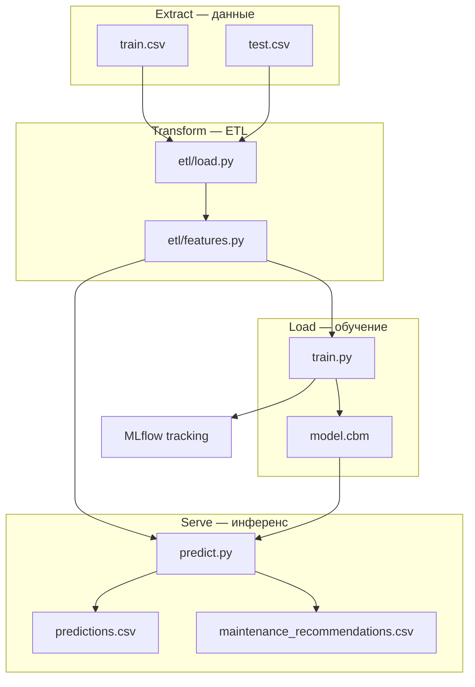

# Скрипин Сергей — Прогноз отказов оборудования

**Автор: Скрипин Сергей**  
Дисциплина: **«Автоматизация машинного обучения»** (Нетология).  
Автоматизированный ML-пайплайн для бинарной классификации отказов промышленного оборудования на датасете [Kaggle Playground Series S3E17](https://www.kaggle.com/competitions/playground-series-s3e17).

   

> **Ссылка на GitHub:** https://github.com/svscrip/auto_ML-prediction_machines_failures  
> **Ветка сдачи проекта:** [main](https://github.com/svscrip/auto_ML-prediction_machines_failures/tree/main)
> **Доступ преподавателю:** добавьте collaborator `@ElenaSmyslovskikh`.

---

## 1. Бизнес-задача

Производственное оборудование генерирует телеметрию (температура, обороты, момент, износ инструмента). Необходимо **заранее оценивать вероятность отказа** (`Machine failure`), чтобы:

- сократить внеплановые простои;
- планировать обслуживание по риску, а не по календарю;
- выдавать рекомендации по КПД и износу инструмента.

Исходный аналитический кейс: [reference-material/keis7-research](reference-material/keis7-research) (ноутбуки `case7.ipynb`, CatBoost в `special_versions/`). Данные для пайплайна: `keis7-main/train.csv`, `keis7-main/test.csv`.

---

## 2. Схема пайплайна



**Поток данных:** CSV → ETL (`load.py`, `features.py`) → обучение CatBoost и логирование в MLflow → инференс на test → прогнозы и рекомендации по обслуживанию.

---

## 3. ETL (Extract, Transform, Load)

| Этап | Модуль | Описание |
|------|--------|----------|
| **Extract** | `src/etl/load.py` | Загрузка CSV, проверка схемы и пропусков |
| **Transform** | `src/etl/features.py` | Инженерные признаки из `reference-material/keis7-research/case7.ipynb`, удаление противоречивых строк (`Machine failure=0` при активных флагах отказа) |
| **Load** | `src/train.py` | Обучение CatBoost, сохранение модели и метрик в `artifacts/` |

**Ключевые преобразования:**

- `delta_temperature [K]` = Process − Air temperature  
- `Power [kW]` = Torque × RPM / 9550  
- `efficiency [%]` — КПД системы  
- `total_failures_cum` — накопленная сумма флагов отказов по (Type, Product ID)

---

## 4. Архитектура ML-модели

- **Алгоритм:** CatBoostClassifier  
- **Признаки:** температуры, RPM, момент, износ, Type, TWF/HDF/PWF/OSF, инженерные поля  
- **Балансировка:** `auto_class_weights=Balanced`  
- **Валидация:** stratified hold-out 80/20  
- **Early stopping** по AUC на validation set  

> **Примечание:** флаги TWF/HDF/PWF/OSF сильно коррелируют с целевой переменной (как в EDA). Для учебного кейса они включены; для production рекомендуется отдельная модель без них.

Конфигурация: [`src/config.py`](src/config.py).

---

## 5. Метрики модели

Алгоритм: **CatBoostClassifier**, stratified hold-out **80/20**, `auto_class_weights=Balanced`, early stopping по **AUC**.

**Текущие метрики пайплайна** ([`artifacts/metrics.json`](artifacts/metrics.json), smoke 5 000 строк):

| Метрика | Значение |
|---------|----------|
| **ROC-AUC** | **0,934** |
| **Recall** | **0,786** |
| **Precision** | **0,393** |
| **F1** | **0,524** |
| **Accuracy** | **0,980** |
| Время обучения | **~5,3 с** |

> Низкий Precision типичен для сильно несбалансированного класса: модель агрессивнее ловит отказы (высокий Recall).

**Базовое исследование** (кросс-валидация, [`model_metadata.json`](reference-material/keis7-research/model_metadata.json)):

| Метрика | Mean | Std |
|---------|------|-----|
| ROC-AUC | 0,927 | 0,007 |
| Recall | 0,804 | 0,024 |
| Precision | 0,364 | 0,012 |
| F1 | 0,501 | 0,013 |

**Важность признаков (Top-5):**

| Признак | Importance |
|---------|------------|
| Torque [Nm] | 11,37 |
| Air temperature [K] | 10,75 |
| Rotational speed [rpm] | 10,68 |
| air_mass | 9,97 |
| Tool wear [min] | 9,87 |

---

## 6. Визуализации

### EDA (разведочный анализ)

| Распределение отказов | КПД vs износ | Тренд КПД |
|-----------------------|--------------|-----------|
|  |  |  |

### Модель CatBoost (пайплайн)

| Confusion Matrix | ROC Curve | Feature Importance |
|------------------|-----------|-------------------|
|  |  |  |

> Актуальные версии после каждого обучения также сохраняются в `artifacts/plots/` и MLflow UI.

---

## 7. Расширенная аналитика

### 7.1. Исходные данные

| Параметр | Значение |
|----------|----------|
| Источник | [Kaggle Playground Series S3E17](https://www.kaggle.com/competitions/playground-series-s3e17) |
| Train | ~136 429 записей (`keis7-main/train.csv`) |
| Test | ~90 954 записей (`keis7-main/test.csv`) |
| Целевая переменная | `Machine failure` (бинарная) |
| Доля отказов (train) | **~1,6–1,8%** (сильный дисбаланс классов) |
| Типы оборудования | **L** (low), **M** (medium), **H** (high) |

**Сырые признаки:** `Air temperature [K]`, `Process temperature [K]`, `Rotational speed [rpm]`, `Torque [Nm]`, `Tool wear [min]`, `Type`, флаги отказов **TWF, HDF, PWF, OSF, RNF**.

**Инженерные признаки (пайплайн):** `delta_temperature [K]`, `Power [kW]`, `air_mass`, `air_heat_power [kW]`, `efficiency [%]`, `total_failures_cum`.

### 7.2. EDA — ключевые выводы

Исходное исследование: [`reference-material/keis7-research/`](reference-material/keis7-research/) (отчёт [`analysis_results_20251206_154833/`](reference-material/keis7-research/analysis_results_20251206_154833/)).

| Показатель | Значение |
|------------|----------|
| Средний КПД системы | **55,82%** (диапазон 50–78%) |
| Средний износ инструмента | **104,4 мин** |
| Всего отказов | **4 239** (~1,8%) |

- Сильная **отрицательная корреляция** между КПД и износом инструмента.
- Отказы чаще при износе **~1,2× выше среднего**.
- Рекомендации EDA: оповещение при КПД **< 80%**, замена инструмента **~200 мин**, диагностика при износе **> 150 мин**.

### 7.3. Качество данных после ETL

Отчёт: [`artifacts/data_quality.json`](artifacts/data_quality.json).

| Показатель | Значение |
|------------|----------|
| Пропуски | **0** по всем колонкам |
| Доля `Machine failure` | **1,38%** |
| Type L / M / H | 3 493 / 1 137 / 357 |

### 7.4. Результаты инференса

Файл: [`artifacts/predictions.csv`](artifacts/predictions.csv) — **90 954** прогноза.

| Уровень риска | Количество | Доля |
|---------------|------------|------|
| Низкий | 45 477 | ~50% |
| Средний | 36 381 | ~40% |
| **Высокий** | **9 096** | **~10%** |

### 7.5. Рекомендации по обслуживанию

[`artifacts/maintenance_recommendations.csv`](artifacts/maintenance_recommendations.csv):

| Проблема | Решение | Приоритет |
|----------|---------|-----------|
| Низкая эффективность системы | Настроить систему при КПД < 50% | Высокий |
| Критический износ инструмента | Плановые замены при износе > **192 мин** | Высокий |
| Высокий прогноз отказа | Целевое обслуживание с `risk_level=Высокий` | Высокий |

### 7.6. Дрейф данных (train → test)

[`artifacts/inference_monitoring.json`](artifacts/inference_monitoring.json) — PSI по каждому признаку с автоматической классификацией (`stable` / `warning` / `critical`). Текущий прогон: **overall_status = stable**, PSI **< 0,001** по всем признакам.

---

## 8. AutoML и автоматизация пайплайна

В проекте применяется **кастомная модель CatBoost** с **автоматизацией элементов MLOps-архитектуры**: единый конфиг, скрипты обучения и инференса, MLflow, CI/CD и Docker. Внешний AutoML-сервис (H2O, Auto-sklearn и т.п.) не используется.

### 8.1. Используемая ML-модель

- **CatBoostClassifier** — градиентный бустинг с нативной поддержкой категориальных признаков.
- Выбор обоснован: нативная работа с категориальными признаками (`Type`, флаги отказов), `auto_class_weights=Balanced` для дисбаланса классов, early stopping по AUC.
- Гиперпараметры заданы в [`src/config.py`](src/config.py) (`CATBOOST_PARAMS`).

### 8.2. Автоматизация элементов пайплайна

1. **Единый конфиг** гиперпараметров CatBoost (`CATBOOST_PARAMS` в `config.py`).  
2. **Скрипт обучения** `python -m src.train` с артефактами и MLflow.  
3. **Скрипт инференса** `python -m src.predict` → `predictions.csv`, `maintenance_recommendations.csv`.  
4. **CI smoke-тест** — автоматический прогон обучения на подвыборке в GitHub Actions.  
5. **Docker** — воспроизводимый запуск train/predict в контейнере.  
6. **MLflow** — единый tracking URI (`artifacts/mlflow.db` + `artifacts/mlartifacts/`).

---

## 9. Тестирование (pytest)

```bash
pip install -r requirements.txt
pytest -q                  # без медленных тестов
pytest -q -m slow          # полный smoke на 5000 строк
```

| Тест | Проверка |
|------|----------|
| `tests/test_load.py` | Схема train.csv |
| `tests/test_features.py` | Формулы Power, efficiency |
| `tests/test_train.py` | Smoke-обучение и метрики |

---

## 10. Docker

### Dockerfile (используемый образ и команды)

```dockerfile
FROM python:3.11-slim          # базовый образ Python
WORKDIR /app                   # рабочая директория
RUN apt-get update && apt-get install -y --no-install-recommends libgomp1 \
    && rm -rf /var/lib/apt/lists/*   # libgomp для CatBoost
COPY requirements.txt .
RUN pip install --no-cache-dir -r requirements.txt   # зависимости
COPY src/ ./src/
COPY conftest.py pytest.ini ./
COPY keis7-main/train.csv keis7-main/test.csv ./keis7-main/
ENV PYTHONPATH=/app
ENV MLFLOW_TRACKING_URI=sqlite:////app/artifacts/mlflow.db
RUN mkdir -p /app/artifacts
ENTRYPOINT ["python", "-m"]
CMD ["src.train", "--smoke"]   # smoke-обучение по умолчанию
```

### Зачем контейнеризация

- **Воспроизводимость** — фиксированные версии библиотек;
- **Изоляция** — независимость от локального окружения;
- **Безопасность и ресурсы** — единый способ запуска на CI/CD и сервере без изменения хост-системы.

### Команды

```bash
docker build -t machine-failure-mlops:latest .

docker run --rm -v "%cd%/artifacts:/app/artifacts" machine-failure-mlops:latest src.train
docker run --rm -v "%cd%/artifacts:/app/artifacts" machine-failure-mlops:latest src.predict

docker compose up train
docker compose up mlflow   # UI на http://localhost:5000
```

---

## 11. CI/CD и качество кода

### Окружение разработки (Poetry + per-project `.venv`)

Проект использует **Poetry** для управления зависимостями и **локальное**
виртуальное окружение `.venv/` в корне репозитория (настраивается в
`poetry.toml`, игнорируется git).

```bash
pip install --user poetry          # установка Poetry
poetry install                     # создать .venv и установить зависимости
poetry run pre-commit install      # подключить git-хуки
```

Windows-хелперы: `.\scripts\bootstrap.ps1` (создание окружения) и
`.\scripts\activate.ps1` (активация). Подробности — в [CONTRIBUTING.md](CONTRIBUTING.md).

### Инструменты качества кода

| Инструмент | Роль | Конфигурация |
|------------|------|--------------|
| **Black** | форматирование (длина строки 88) | `pyproject.toml` |
| **isort** | сортировка импортов (profile=black) | `pyproject.toml` |
| **flake8** (+ flake8-bugbear) | PEP8 + баг-детектор | `.flake8` |
| **pre-commit** | единая точка запуска хуков | `.pre-commit-config.yaml` |
| **pytest** (+ pytest-cov) | тесты и покрытие | `pyproject.toml` |

```bash
poetry run pre-commit run --all-files   # линт + формат по всем файлам
poetry run pytest -q                    # быстрые тесты
poetry run pytest -q -m slow            # полный smoke-тест обучения
```

### Workflow CI — [`.github/workflows/ci.yml`](.github/workflows/ci.yml)

1. **lint** — `pre-commit run --all-files` (black, isort, flake8 и файловые чекеры);
2. **test** — матрица Python **3.11 / 3.12 / 3.13**: `poetry install` → `pytest` с покрытием;
3. **docker** — `docker build` + smoke-прогоны `src.train --smoke` и `src.predict` в контейнере.

### Workflow CD — [`.github/workflows/cd.yml`](.github/workflows/cd.yml)

По тегу `v*`: тесты → сборка и публикация Docker-образа в **GHCR** → GitHub Release.

Зависимости обновляются автоматически через [`.github/dependabot.yml`](.github/dependabot.yml).

### Git-команды (использованные при разработке)

```bash
git init
git add .
git commit -m "Initial MLOps pipeline for machine failure prediction"
git branch -M main

git remote add origin https://github.com/svscrip/auto_ML-prediction_machines_failures.git
git push -u origin main
```

**Работа через ветки и pull request:**

```bash
git checkout -b feature/etl
git add . && git commit -m "feat: ETL and feature engineering"
git push -u origin feature/etl
gh pr create --title "feat: ETL" --base main
```

---

## 12. Мониторинг

Мониторинг реализован в [`src/monitoring.py`](src/monitoring.py) и вызывается при обучении (`train.py`) и инференсе (`predict.py`).

### Что отслеживается

| Этап | Качество модели | Качество данных | Инфраструктура |
|------|-----------------|-----------------|----------------|
| **Обучение** | ROC-AUC, Recall, Precision, F1 → MLflow + `metrics.json` | пропуски, `target_rate`, распределение Type → `data_quality.json` | CPU/RAM до/после, **время обучения** (`psutil`, `train_time_sec`) |
| **Инференс** | доля `risk_level=Высокий` | PSI и сдвиг средних train→test | CPU/RAM до/после, **время инференса** (`inference_time_sec`, `rows_per_sec`) |

### Качество модели (MLflow)

- **Backend:** `artifacts/mlflow.db` (SQLite) + `artifacts/mlartifacts/`
- **Эксперимент:** `machine_failure_prediction`

**Логируются в каждый run:**

| Категория | Параметры / метрики |
|-----------|---------------------|
| Модель | `roc_auc`, `recall`, `precision`, `f1`, `train_time_sec` |
| Инфраструктура | `cpu_percent_before/after`, `ram_used_percent_before/after` |
| Артефакты | `model.cbm`, графики (confusion matrix, ROC, feature importance), `model_metrics.png`, `infrastructure_training.png`, `data_quality.json`, `monitoring_summary.json` |

```bash
.\scripts\start-mlflow.ps1          # локально → http://localhost:5000
docker compose up mlflow            # тот же backend в контейнере
```

**Сводный отчёт обучения:** [`artifacts/example_monitoring_summary.json`](artifacts/example_monitoring_summary.json)

### Качество данных и дрейф

| Файл | Назначение |
|------|------------|
| `artifacts/data_quality.json` | Статистики train после ETL, пропуски, CPU/RAM |
| `artifacts/inference_monitoring.json` | PSI по признакам, статус дрейфа, качество test |
| `artifacts/monitoring_summary.json` | Сводка мониторинга после обучения |
| `artifacts/maintenance_recommendations.csv` | Бизнес-рекомендации |
| `artifacts/predictions.csv` | Прогнозы по каждой единице оборудования |

**PSI (Population Stability Index)** — интерпретация дрейфа:

| PSI | Статус | Действие |
|-----|--------|----------|
| **< 0,1** | stable | распределение стабильно |
| **0,1 – 0,25** | warning | усилить контроль признака |
| **≥ 0,25** | critical | возможен дрейф, нужна переобучение/проверка данных |

Текущий прогон: все признаки **stable** (PSI **< 0,001**). Пример: [`artifacts/example_inference_monitoring.json`](artifacts/example_inference_monitoring.json).

### Инфраструктура (CPU/RAM)

| Момент | CPU | RAM (использовано) |
|--------|-----|---------------------|
| До обучения | 18,1% | 54,3% (31,9 GB total) |
| После обучения | 5,7% | 54,5% |
| Инференс (batch) | до/после в отчёте | ~55% |
| **Время обучения** | — | **~5–6 с** (smoke) |
| **Время инференса** | — | **~0,01 с** (модель) / **~1,2 с** (полный pipeline на 90 954 строк) |

Примеры: [`artifacts/example_metrics.json`](artifacts/example_metrics.json), [`artifacts/example_inference_monitoring.json`](artifacts/example_inference_monitoring.json).

### Графики мониторинга

| Метрики модели | Инфраструктура (обучение) | Инфраструктура (инференс) | Data Drift (PSI) |
|----------------|---------------------------|---------------------------|------------------|
|  |  |  |  |

> Графики генерируются автоматически при `python -m src.train` и `python -m src.predict`.  
> Для обновления в README: `.\scripts\sync-monitoring-images.ps1`

---

## 13. GitHub-репозиторий

**Репозиторий проекта:** https://github.com/svscrip/auto_ML-prediction_machines_failures  
**Ветка сдачи:** https://github.com/svscrip/auto_ML-prediction_machines_failures/tree/main

- Репозиторий **публичный** (открытый доступ для проверки).
- CI: GitHub Actions — pytest + Docker smoke train (см. §11).
- Доступ преподавателю: `@ElenaSmyslovskikh`.

---

## 14. Презентация

Структура слайдов (5–7): [`docs/presentation.md`](docs/presentation.md).

---

## 15. Автор

**Скрипин Сергей** — пайплайн (ETL, обучение, инференс, мониторинг),
инфраструктура (Docker, CI/CD), документация и презентация.

### Git workflow

- Базовая ветка — `main`; новая функциональность — в ветках `feature/<имя>`.
- Изменения вливаются через **pull request** после зелёного CI.
- Стиль коммитов — [Conventional Commits](https://www.conventionalcommits.org/)
  (`feat:`, `fix:`, `docs:`, ...).

---

## Приложение A. Быстрый старт (локально)

```bash
pip install --user poetry
poetry install

poetry run python -m src.train          # полное обучение
poetry run python -m src.train --smoke  # быстрый smoke-прогон
poetry run python -m src.predict
```

Активация окружения вручную: `.\scripts\activate.ps1` (Windows) или
`source .venv/bin/activate` (Linux/macOS).

Структура проекта:

```
auto_ML-prediction_machines_failures/
├── src/                        # пайплайн (etl/, train, predict, monitoring, plots)
├── tests/                      # pytest
├── keis7-main/                 # train.csv, test.csv
├── reference-material/         # ноутбуки, задание, исследования
├── docs/                       # презентация, images/
├── artifacts/                  # модель, метрики, предсказания
├── scripts/                    # bootstrap.ps1, activate.ps1, запуск MLflow
├── pyproject.toml              # зависимости + конфиг black/isort/pytest
├── poetry.lock                 # lock-файл зависимостей
├── .flake8                     # конфиг flake8
├── .pre-commit-config.yaml     # git-хуки
├── Dockerfile                  # образ пайплайна
├── Dockerfile.mlflow           # образ MLflow UI
├── docker-compose.yml
└── .github/workflows/          # ci.yml, cd.yml + dependabot.yml
```

---

## Приложение B. Вклад в проект

Правила разработки, стиль кода, тесты и git-workflow — в [CONTRIBUTING.md](CONTRIBUTING.md).

---

## Лицензия и данные

Данные: Kaggle Playground Series S3E17. Исходные ноутбуки исследования — в `reference-material/`.
